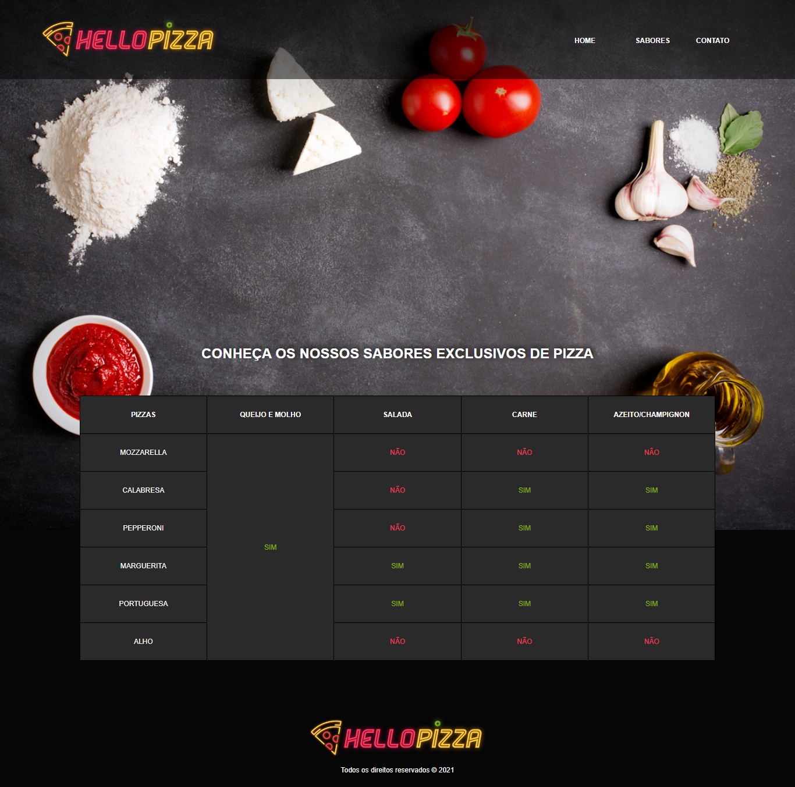

# Hello Pizza
 Projeto tem como objetivo à prática de tabelas em HTML.

 ## Technologies Used in Project

    
    
    

 

## Access here
<a 
href="https://germeson-martins.github.io/hello_pizza" target="_blank">Hello Pizza
</a>

